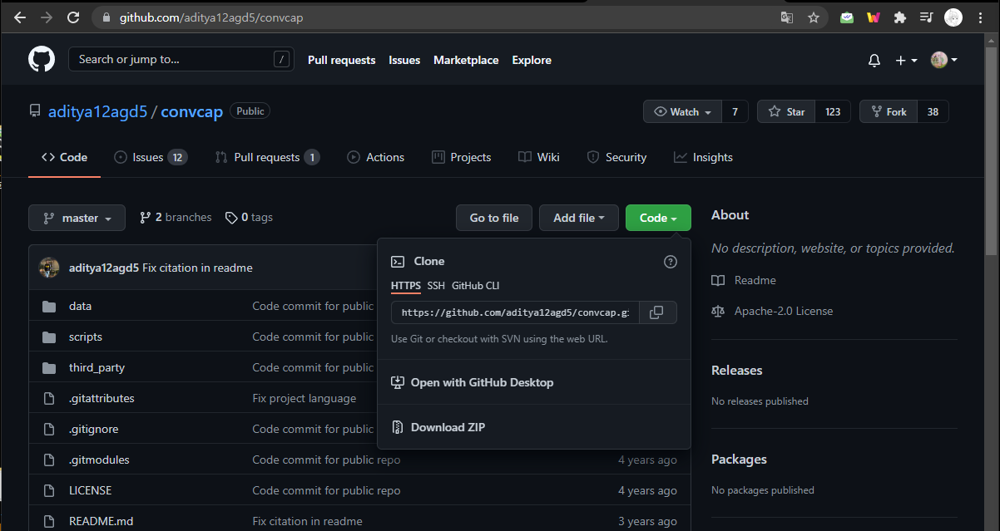
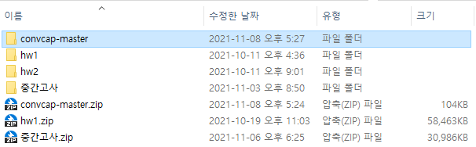
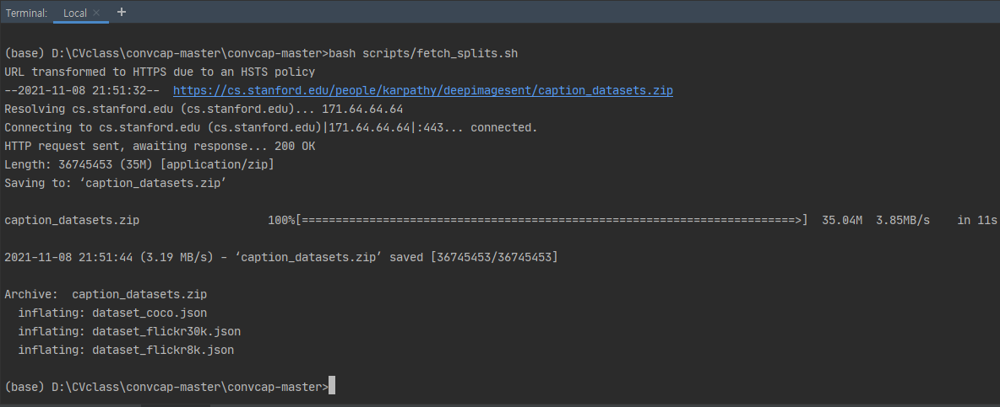
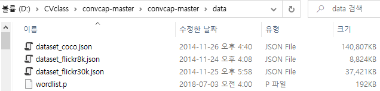
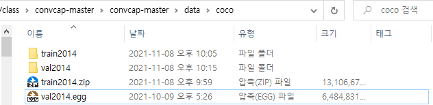

## 환경 설정

1. 해당 [github](https://github.com/aditya12agd5/convcap) 에서 **Download ZIP**을 클릭하여 다운 받은 후 압축을 풉니다.






2. 코드 실행을 위한 가상환경을 만들어 줍니다.

```
conda create -n convcap python=3.8
conda activate convcap
```


3. 필요한 라이브러리를 설치해 줍니다.

- torch 설치: https://pytorch.kr/get-started/previous-versions/
  
  torch는 자신의 컴퓨터 환경에 맞게 설치해주세요. 저는 cuda 11.4까지 사용 가능해서 다음과 같이 설치를 했습니다.

```
conda install pytorch==1.8.0 torchvision==0.9.0 torchaudio==0.8.0 cudatoolkit=11.1 -c pytorch -c conda-forge
```

- 기타 라이브러리

```
pip install cython matplotlib scikit-image tqdm numpy Pillow
pip install jupyter
pip install "git+https://github.com/philferriere/cocoapi.git#egg=pycocotools&subdirectory=PythonAPI"
pip install "git+https://github.com/salaniz/pycocoevalcap.git"
```
> - 저는 Terminal 창에서 실행하지 않고 jupyter notebook에서 실행했기 때문에 jupyter도 함께 설치했습니다.


4. 본 코드는 Python2.7에서 돌아가므로 Python3 이상에서 사용하려면 고쳐야 하는 부분이 있습니다.

- evaluate.py
  `print 'Using %d/%d predictions' % (len(preds_filt), len(preds))` 코드를 `print('Using %d/%d predictions' % (len(preds_filt), len(preds)))` 로 변경합니다.


5. 아래 명령어를 Terminal 창에서 실행해 데이터를 train/val/test 로 나눠줍니다.

```
bash scripts/fetch_splits.sh
```

> - 저는 윈도우 앱 Ubuntu를 설치하였고 Ubuntu 에 unzip도 설치 했던 것 같습니다. 위의 명령어를 실행했을 때 에러가 발생하면 명령어가 없어서 발생했을 가능성이 높습니다.

`scripts/fetch_splits.sh` 를 확인하면 아래와 같이 `caption_datasets.zip` 를 받아와 data 폴더에 이동시켜 주는 것을 확인할 수 있습니다.

```
wget http://cs.stanford.edu/people/karpathy/deepimagesent/caption_datasets.zip
unzip caption_datasets.zip
mv dataset_* ./data/
rm caption_datasets.zip
```

Pycharm의 Terminal에서 명령어를 실행한 모습은 다음과 같습니다.




6. train2014, val2014 이미지 데이터를 [MSCOCO](http://cocodataset.org/#download) 웹페이지에서 다운받아 `./data/coco` 에 저장합니다.

- 이미지 데이터를 `./data/coco` 에 저장하기 전 폴더의 모습



- 이미지 데이터를 `./data/coco` 에 저장한 후 폴더의 모습



- 루트 폴더에 `output` 폴더를 생성합니다


7. 코드를 또 수정합니다.

- coco_loader.py의 코드를 바꿔줍니다.
  `words = str(caption).lower().translate(None, string.punctuation).strip().split()` 코드를 `words = str(caption).lower().translate(str.maketrans('', '', string.punctuation)).strip().split()` 로 바꿔줍니다.
  
- evaluate.py에서 `preds_filt = [p for p in preds if p['image_id'] in valids]` 코드 이후에 아래의 코드를 추가합니다.
```
  len_p = len(preds_filt)
  for i in range(len_p):
    preds_filt[i]['image_id'] = int(preds_filt[i]['image_id'])
```
아래 사진은 코드를 추가한 모습입니다.


8. annotations 폴더 생성 후 파일 추가

- `third_party` 안에 `annotations` 폴더를 생성합니다.


- 다음 링크에서 `captions_val2014.json` 파일을 다운 받아 `annotations`에 추가합니다.

https://drive.google.com/file/d/1zPwVcmmGxu2XD7RlHmhrEQ_vPbjeXILq/view?usp=sharing


9. 제가 올린 2개의 파일을 살펴봅니다.

- `convcap train&test (ComputerVision).ipynb` : coco 데이터 셋에 대해 훈련하고 테스트하는 파일입니다. 환경만 잘 설정하셨다면 실행할 때 문제는 없을 것입니다.
- `convcap new image test (ComputerVision).ipynb` : 훈련한 모델을 새로운 이미지를 사용해 테스트하는 파일입니다. 저는 `my_image` 폴더를 생성하여 10개의 이미지에 대해 테스트를 진행했습니다.
- 저는 터미널 창에서 진행하지 않았고 위와 같이 2개의 주피터 노트북 파일에서 코드를 돌렸습니다.
- 첫 번째 `convcap train&test (ComputerVision).ipynb` 파일을 돌리면 root 폴더의 output 폴더 내에 result_test.json 파일이 생성됩니다. 이 파일을 제출하시면됩니다.
- 두 번째 `convcap new image test (ComputerVision).ipynb` 파일은 자신이 원하는 이미지로 훈련된 모델을 테스트 해 볼 수 있습니다. 파일을 보시면 아시겠지만 저는 root 폴더 내에 `my_image` 폴더를 생성하여 거기에 제가 테스트하고 싶은 이미지를 넣었습니다.


10. 테스트 결과를 살펴봅니다.


a group of people standing on top of a mountain


a cat sitting on a ground next to a dead tree


a group of people sitting around a table with a laptop


a large building with a large building in the background


a plate of food with a fork and a fork


a table with a bunch of different types of items


a busy city street with cars and cars


two brown bears are sitting on a tree


a man is standing next to a large elephant


a man is standing next to a large elephant


==============================================================================================


## 개요

본 챌린지는 Vision-Language Task 중에서 이미지 캡셔닝을 수행하는 챌린지입니다. 이미지 캡셔닝은 아래와 같이 이미지의 내용을 설명하는 문장을 생성하는 작업입니다. 


이미지 캡셔닝 기술을 통해 시력이 낮거나 없는 사람들에게 사진에 대한 설명을 제공할 수 있고 사진에 설명을 추가하여 검색 효율을 높일 수 있습니다.


## 데이터셋

이미지 캡셔닝에서 사용하는 데이터셋은 이미지와 텍스트로 이루어져있고 보통 한 이미지에 대해 5개의 문장으로 구성되어 있습니다. 아래는 MSCOCO 데이터의 예시이며 여기서는 이미지 당 한 문장씩 보여줍니다.


**이미지**

이미지 데이터는 [cocodataset](https://cocodataset.org/#download) 에서 받을 수 있습니다. 본 챌린지에서는  2014 Train images 와 2014 Val images 를 사용합니다.


**텍스트**

텍스트 데이터는 "Andrej Karpathy's training, validation, and test splits 를 사용하고 [standford](http://cs.stanford.edu/people/karpathy/deepimagesent/caption_datasets.zip) 에서 다운 받으실 수 있습니다. 다운 받으신 후 압축을 풀면 3개의 json 파일이 있을텐데 본 챌린지에서는 `dataset_coco.json`을 사용합니다.

텍스트 데이터는 json 구조이며 이미지에 대한 경로, 캡션 등으로 이루어져있습니다.

```
[{'filepath': 'val2014',
  'sentids': [681330, 686718, 688839, 693159, 693204],
  'filename': 'COCO_val2014_000000522418.jpg',
  'imgid': 1,
  'split': 'restval',
  'sentences': [{'tokens': ['a',
     'woman',
     'wearing',
     'a',
     'net',
     'on',
     'her',
     'head',
     'cutting',
     'a',
     'cake'],
    'raw': 'A woman wearing a net on her head cutting a cake. ',
    'imgid': 1,
    'sentid': 681330},
    ...]
```

splits 는 'train', 'restval', 'val', 'test'로 이루어져 있으며 'train', 'restval' splits를 사용해 모델 훈련을 하고 'val' splits를 사용해 검증을 합니다. 마지막으로 'test' splits를 사용해 성능을 평가합니다.

- train(train+restval): 113287
- val: 5000
- test: 5000

데이터에 대한 정보가 궁금하신 분들은 아래 사이트에서 확인하면 도움이 될 것 같습니다.

- https://www.tensorflow.org/datasets/catalog/coco_captions

- https://cs.stanford.edu/people/karpathy/deepimagesent/


## 베이스라인

본 챌린지에서 사용한 베이스 라인 방법론은 Convolutional Image Captioning 논문입니다.

- 깃허브 주소: https://github.com/aditya12agd5/convcap


## 동영상

챌린지 설명, 논문의 방법론, 베이스라인 코드 설명하는 영상의 주소는 다음과 같습니다.

- 유튜브: https://www.youtube.com/watch?v=gfzjD70osvE


## 추천하는 논문

- Convolutional sequence to sequence learning.

  베이스라인 모델은 위 논문에서 사용된 convolutional 기계 번역 모델을 기반으로 했습니다.

- Deep visual-semantic alignments for generating image descriptions.

  베이스라인과 다르게 기존의 이미지 캡셔닝 모델은 LSTM을 사용했습니다. 위 논문이 대표적으로 LSTM 기반 이미지 캡셔닝 모델을 사용했습니다.
  
  
  
  
## 제출 파일 형식

제출할 파일의 확장자는 `.json` 입니다. 제출할 파일의 형식은 다음과 같고 형식을 맞춰줘야 평가가 가능합니다.

```
[{"image_id": 391895, "caption": "a man is standing on a bike in the woods"}, {"image_id": 60623, "caption": "a woman is eating a piece of cake"},
...]
```


## 평가지표
이미지 캡셔닝에서 자주 사용하는 평가지표로 **Bleu_1, Bleu_2, Bleu_3, Bleu_4, METEOR, ROUGE_L, CIDEr, SPICE** 를 사용합니다. 점수가 높을수록 성능이 좋다는 것을 의미합니다.
